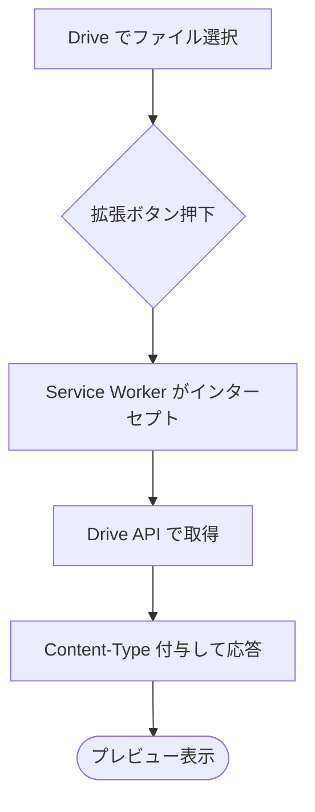
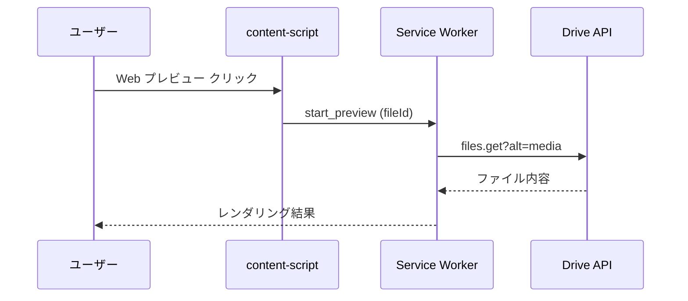

# 06 - Mermaid 記法テスト

このページは Markdown 内の ` ```mermaid ` コードブロックが、ソースのままではなく **図として描画**されることを確認するサンプルです。描画はプレビュータブ内の `assets/mermaid-runtime.js` が行います（`docs/MERMAID.md`）。

## 確認ポイント

- [x] 下の各図が SVG として描画されている（コードのまま表示されていない）
- [x] 通常のコードブロック（mermaid 以外）はコードのまま表示される

## フローチャート



## シーケンス図



## ガントチャート

```mermaid
gantt
    title プレビュー処理の流れ
    dateFormat  X
    axisFormat  %s
    section 取得
    インターセプト      :0, 1
    Drive API 取得      :1, 3
    section 応答
    Content-Type 付与   :3, 4
    描画                :4, 5
```



## 通常のコードブロック（描画されない＝コードのまま）

```js
// これは mermaid ではないのでコードとして表示される
const x = 1 + 2;
```

---

3 つの図が描画され、最後の JS だけがコードのまま表示されていれば成功です。
